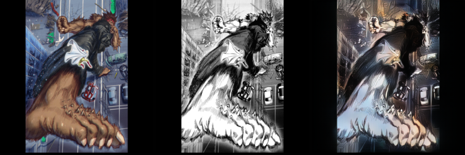
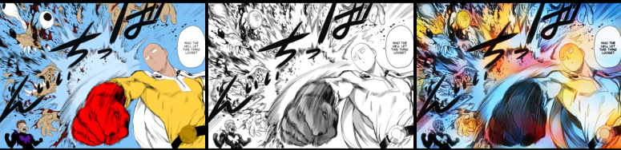

# Sketch Colorization based on Reference and Structure

This is an unofficial Pytorch implementation of the paper `Reference-guided structure-aware deep sketch colorization for cartoons` 
[[Paper](https://link.springer.com/article/10.1007/s41095-021-0228-6)]

## Table of Contents
- [Project Description](#project-description)
  - [Main Model](#main-model)
  - [Fine-Tune Model](#fine-tune-model)
- [Datasets](#datasets)
- [Requirements](#requirements)
- [Results Main Model](#results-main-model)
- [Results Fine-Tune Model](#results-fine-tune-model)

## Project Description

This repository contains the implementation of a sketch colorization network. The output image of this network should have the colors of a reference image, while preserving the structure of the input sketch image.

This project involves two different trainings. First, the main model is trained using the same dataset as the original authors, and the resulting model is then fine-tuned using a custom dataset. This last model has a slight modification to improve results.

### Main Model

The main model consists of three components.
- A **color style extractor network** to extract the colors from a reference image, using 4 ResNet blocks and global average
pooling. The output is the color style code, which is a vector with a dimension of 256.
- A **colorization network** to generate multi-scale output images by combining an input sketch with the colors from the extractor. This network is based on the U-Net structure, with a downscaling sketch encoder and an upscaling style-content fusion decoder.
- A **multi-scale discriminator** to improve the results by ensuring a realistic colorization.

  

Please refer to the original [paper](https://link.springer.com/article/10.1007/s41095-021-0228-6) for more details.

### Fine-Tune Model

After training the main model, I wanted to use the results in a more complex scenario, with sketches that require more color (like background or objects), with the intention to fine-tune the model to colorize sketches from a specific manga. For this experiment, the One Punch Man manga was chosen. 

For the fine-tune model, the way in which colors are extracted and combined was modified. In this setting, the color style extractor outputs 4 different color style codes, each one coming from the last four ResNet blocks; then, each one of these representations is fused with a decoder block from the colorization network. This change is due to the fact that more vivid colors were observed under this configuration.

## Datasets
- [**Anime Sketch Colorization Pair**](https://www.kaggle.com/datasets/ktaebum/anime-sketch-colorization-pair): Publicly available dataset with 17,769 images containing a sketch and its color version. 14,224 images are used for training and 3,545 for evaluation (testing). 
- [**One Punch Man Manga Colorization**](https://drive.google.com/file/d/1VqTvDQwLUJWVL7TzpmuOzIUMNJvZ7mKY/view?usp=sharing): Custom dataset with 3,546 pairs of images (color and sketch). 2,837 pairs are used for training, 177 for validation and 532 for testing. The color images were obtained scraping the One Punch Man [subreddit](https://www.reddit.com/r/onepunchman/) and the corresponding sketches were extracted using [Anime2Sketch](https://github.com/Mukosame/Anime2Sketch).
  
## Requirements
- Python 3
- Pytorch >= 1.6 (torch and torchvision)
- Numpy
- [PIQ](https://github.com/photosynthesis-team/piq) (for evaluation metrics)

## Results Main Model

The results obtained in this implementation are not as good as the ones reported in the paper, it is observed that some colors do not propagate correctly. The model was trained for 100 epochs, as the colorization did not improve after this point. 

During training, the adversarial loss dropped close to zero after epoch 25, this may be one of the reasons why the results are not excellent. Also, because there is no validation data, it's difficult to identify if overfitting was present.

### Metrics

Each metric is evaluated in two ways, using the correct paired sketch/reference and using a differente reference, as shown in the images below. The results obtained in paired sketch/reference are similar to the reference paper.

<table>
<thead>
  <tr>
    <th></th>
    <th colspan="2">PSNR</th>
    <th colspan="2">SSIM</th>
    <th colspan="2">FID</th>
  </tr>
</thead>
<tbody>
    <tr>
        <td></td>
        <td>Paired sketch/reference</td>
        <td>Different reference</td>
        <td>Paired sketch/reference</td>
        <td>Different reference</td>
        <td>Paired sketch/reference</td>
        <td>Different reference</td>
    </tr>
    <tr>
        <td>Reference</td>
        <td>22.43</td>
        <td>17.25</td>
        <td>0.85</td>
        <td>0.74</td>
        <td>-</td>
        <td>27.99</td>
    </tr>
    <tr>
        <td><b>Obtained</b></td>
        <td>20.11</td>
        <td>13.41</td>
        <td>0.84</td>
        <td>0.56</td>
        <td>155.46</td>
        <td>174.0</td>
    </tr>
</tbody>
</table>

### Images

<table>
  <tr>
    <td>Reference</td>
    <td rowspan="3"></td>
  </tr>
  <tr>
    <td>Input</td>
  </tr>
  <tr>
    <td>Result</td>
  </tr>
    <tr>
    <td>Reference</td>
    <td rowspan="3"></td>
  </tr>
  <tr>
    <td>Input</td>
  </tr>
  <tr>
    <td>Result</td>
  </tr>
</table>

## Results Fine-Tune Model

The fine-tune model was trained for 60 epochs, as the performance of the validation set did not improve after this point. It is worth mentioning that the adversarial loss remained relatively constant and did not drop to zero.

The results are not perfect, but the model shows potential, considering that this task is much more difficult and the dataset is smaller.

### Metrics

All metrics are evaluated using the correct paired sketch/reference.

<table>
<thead>
  <tr>
    <th></th>
    <th>PSNR</th>
    <th>SSIM</th>
    <th>FID</th>
  </tr>
</thead>
<tbody>
    <tr>
        <td>Obtained</td>
        <td>19.542</td>
        <td>0.748</td>
        <td>151.057</td>
    </tr>
</tbody>
</table>

### Images

<table>
  <tr align='center'>
    <td>Reference</td>
    <td>Input &nbsp;&nbsp;&nbsp;&nbsp;</td>
    <td>Result &nbsp;&nbsp;&nbsp;</td>
  </tr>
  <tr>
    <td align='center' colspan="3">
        
    </td>
  </tr>
  <tr>
    <td align='center' colspan="3">
        
    </td>
  </tr>
  <tr>
    <td colspan="3">
    

    Better results were observed with a simplified sketch, instead of the original manga image as input.
    

    </td>
  </tr>
  <tr>
    <td align='center' colspan="3">
        
    </td>
  </tr>
  <tr>
    <td align='center' colspan="3">
        
    </td>
  </tr>
  <tr>
    <td align='center' colspan="3">
        
    </td>
  </tr>
  <tr>
    <td align='center' colspan="3">
        
    </td>
  </tr>
  <tr>
    <td colspan="3">
    

    Even with a bad reference, the model tries to fill the image with color.
    

    </td>
  </tr>
  <tr>
    <td align='center' colspan="3">
        
    </td>
  </tr>
  <tr>
    <td align='center' colspan="3">
        
    </td>
  </tr>
  <tr>
    <td colspan="3">
    

    As a limitation of the model, if the image has too many details, the result fails completely.
    

    </td>
  </tr>
  <tr>
    <td align='center' colspan="3">
        
    </td>
  </tr>
</table>

